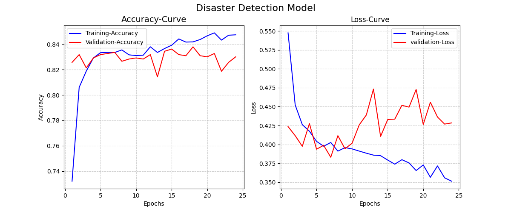

# 🚨 Disaster Detection with BERT — Feature Extraction, Fine-Tuning & Custom Training Loop

### 🔍 Overview
This project implements **BERT-based tweet classification** for **disaster detection**, exploring three progressively advanced training strategies.  
It demonstrates both *high-level fine-tuning* and *low-level custom training* of transformer models, offering insights into model control, optimization, and training dynamics.

---

## 🧠 Project Highlights
- **Model:** BERT (Bidirectional Encoder Representations from Transformers)
- **Dataset:** 8,562 labeled tweets  
  - 85% training, 15% validation  
- **Task:** Binary classification — detecting whether a tweet describes a real disaster or not  
- **Framework:** TensorFlow + Keras  

---

## ⚙️ Training Approaches

### **1️⃣ Feature Extraction**
- BERT used as a frozen feature extractor  
- Trained a custom classifier on top  
- Achieved **79% accuracy** and **0.48 validation loss**  
- ✅ Great for understanding representation power of pretrained models

---

### **2️⃣ Fine-Tuning (Keras API)**
- Unfroze last 1 BERT encoder layer + pooler + new dense layers  
- Used `model.fit()` with separate optimizers  
- Trained for 30 epochs  
- Achieved **83% validation accuracy** and **0.405 validation loss**  
- ✅ Balanced performance and simplicity

---

### **3️⃣ Custom Training Loop (tf.GradientTape)**
- Differential learning rates:
  - **BERT layers:** small LR, 4 epochs  
  - **Dense layers:** larger LR, 20 epochs  
- Complete control over:
  - Gradient computation  
  - Optimizer updates  
  - Validation metrics per epoch  
- Achieved **84% validation accuracy** and **0.386 validation loss**  
- ✅ Fine-grained control and maximum flexibility  

---

## 🧩 Repository Structure

```
├── data/ # Dataset and preprocessing assets
├── assets/ # Plots, figures, and visuals
├── models/ # Saved model checkpoints and weights
├── src/
│ ├── init.py
│ ├── data_loader.py # Loads and preprocesses the tweet dataset
│ ├── model.py # BERT model definition and custom layers
│ ├── train.py # Fine-tuning with Keras model.fit()
│ ├── train_custom_loop.py # Custom training loop implementation with GradientTape
│ ├── utils.py # Helper utilities and metrics
│ ├── inference.py # Model inference and evaluation scripts
│
├── .gitignore
├── LICENSE
├── requirements.txt
├── README.md
```
---

## 🧩 Installation

First, clone the repository and install dependencies:

```bash
git clone https://github.com/armingolzar/Disaster_Detection_Tweet_BERT_LLM.git
cd Disaster_Detection_Tweet_BERT_LLM
pip install -r requirements.txt
```
## 🚀 How to Run
#### ▶️ Run Training (Feature Extraction)
This mode uses BERT as a frozen feature extractor and trains only the top dense layers:
```bash
python -m src.train
```
#### ⚡ Run Training (Fine-Tuning with Custom Loop)
This mode trains with differential learning rates using a custom tf.GradientTape loop:
```bash
python -m src.train_custom_loop
```
---

## 📊 Results Summary

| Training Mode          | Train Acc | Val Acc | Val Loss | Description |
|------------------------|------------|----------|-----------|--------------|
| Feature Extraction     | 72%        | 79%      | 0.48      | BERT frozen, classifier trained |
| Fine-Tuning (Keras)    | 84%        | 83%      | 0.405     | 1 BERT encoder layer + pooler trained |
| Custom Training Loop   | 86%        | 84%      | 0.386     | Differential LR, full control |

---

## 📈 Visual Results
Example training curves for the **custom training loop**:



---

## 🧰 Technologies Used
- TensorFlow / Keras  
- Transformers (BERT-base-uncased)  
- NumPy / Pandas  
- Matplotlib / Seaborn  

---

## 🚀 Key Takeaways
- Demonstrated **three levels of BERT utilization** — from high-level abstraction to low-level control  
- Built **custom gradient management and optimizer logic**  
- Showed **strong understanding of training dynamics** for large language models  
- Fully modular GitHub-ready code structure  

---

## 💡 Future Work
- Experiment with **RoBERTa** and **DistilBERT** for performance vs. efficiency  
- Add **data augmentation** for tweet text  
- Integrate **hyperparameter optimization** for dense layer design  

---

## 📜 License
This project is licensed under the **MIT License** — see [LICENSE](LICENSE) for details.

---

## 🔗 Links
- **GitHub Repository:** [Disaster_Tweet_Detection_using_BERT_LLM](https://github.com/armingolzar/Disaster_Detection_Tweet_BERT_LLM)  
- **Author:** [Armin Golzar](https://www.linkedin.com/in/armingolzar/)

---

### ✨ “From feature extraction to full transformer control — this project shows the journey from using AI to mastering it.”